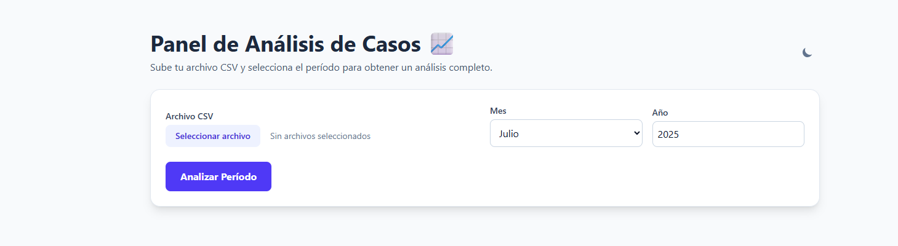
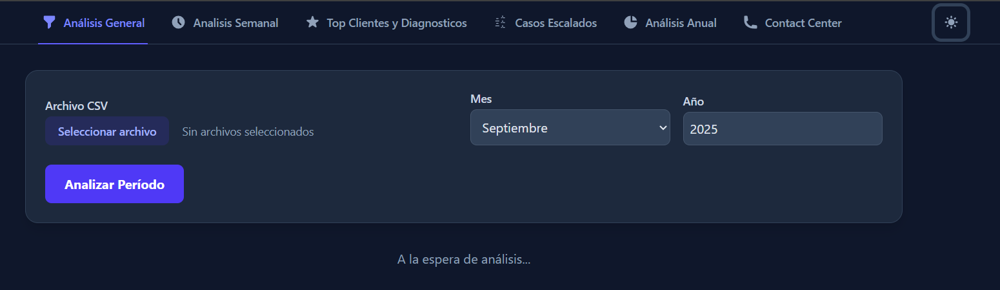

# 📊 Panel de Análisis de Datos Avanzado

Este proyecto es una aplicación web interactiva y completa, construida con **Astro** y **Tailwind CSS**, diseñada para realizar análisis complejos sobre datos de operaciones. La plataforma permite a los usuarios subir archivos CSV o TSV y obtener visualizaciones detalladas, métricas clave y rankings de rendimiento a través de múltiples paneles de análisis especializados.




---

## ✨ Características Principales

- **Múltiples Paneles de Análisis**: Navegación por pestañas para acceder a diferentes módulos de análisis.
- **Carga de Archivos Múltiples**: Soporte para diferentes tipos de archivos (CSV para análisis de casos, TSV para métricas de contact center).
- **Visualización de Datos Avanzada**: Gráficos interactivos de torta, barras y líneas para una fácil interpretación de los datos.
- **Filtros Dinámicos e Interactivos**: Filtra datos por período (mes/año) y selecciona agentes específicos para un análisis granular.
- **Lógica de Negocio Compleja**: Cálculos de métricas estándar de la industria como Nivel de Servicio, ASA, ASQ y AHT.
- **Modo Oscuro 🌙**: Un toggle en la navegación para cambiar entre temas, con persistencia de la preferencia.
- **Exportación de Datos**: Descarga los datos procesados del análisis general en un archivo `.csv` limpio.
- **Arquitectura Modular y Escalable**: El código está organizado en módulos de JavaScript para facilitar el mantenimiento y la adición de nuevas funcionalidades.

---

## 🛠️ Tecnologías Utilizadas

- **Framework**: [Astro](https://astro.build/) - Para un rendimiento óptimo en sitios orientados al contenido.
- **Estilos CSS**: [Tailwind CSS](https://tailwindcss.com/) - Para un diseño moderno, responsivo y personalizable.
- **Parseo de Archivos**: [PapaParse](https://www.papaparse.com/) - Para leer y procesar archivos CSV y TSV en el navegador.
- **Gráficos**: [Chart.js](https://www.chartjs.org/) - Para crear visualizaciones de datos interactivas y estéticas.

---

## 🚀 Cómo Empezar

Sigue estos pasos para levantar el proyecto en tu máquina local.

### Prerrequisitos

- Tener instalado [Node.js](https://nodejs.org/) (versión 18.0 o superior).
- Un editor de código como [Visual Studio Code](https://code.visualstudio.com/).

### Instalación

1.  **Clona el repositorio**:

    ```bash
    git clone [https://github.com/tu-usuario/tu-repositorio.git](https://github.com/tu-usuario/tu-repositorio.git)
    cd tu-repositorio
    ```

2.  **Instala las dependencias**:

    ```bash
    npm install
    ```

3.  **Configura Tailwind CSS para el Modo Oscuro**:
    Asegúrate de que tu archivo `tailwind.config.mjs` tenga la siguiente configuración:

    ```javascript
    /** @type {import('tailwindcss').Config} */
    export default {
      darkMode: "class",
      content: ["./src/**/*.{astro,html,js,jsx,md,mdx,svelte,ts,tsx,vue}"],
      theme: { extend: {} },
      plugins: [],
    };
    ```

4.  **Inicia el servidor de desarrollo**:

    ```bash
    npm run dev
    ```

5.  **Abre tu navegador** y visita `http://localhost:4321` para ver la aplicación funcionando.

---

## 📁 Estructura del Proyecto

La aplicación sigue una arquitectura modular para máxima escalabilidad:

- `src/components/`: Contiene todos los componentes `.astro` que conforman la interfaz visual (la navegación, cada panel de análisis, etc.). Estos componentes no contienen lógica de JavaScript.
- `src/pages/index.astro`: La página principal que organiza y muestra todos los componentes. Es el único lugar donde se importa el script principal.
- `src/js/`: Contiene toda la lógica de la aplicación, separada por responsabilidades:
  - `analysis.js`: El motor de la aplicación. Contiene todas las funciones que realizan los cálculos y procesan los datos.
  - `dom-updates.js`: El motor de visualización. Contiene las funciones que toman los datos analizados y los renderizan en el HTML (creando tablas, gráficos, etc.).
  - `ui.js`: Gestiona los elementos de la interfaz de usuario, como la navegación por pestañas.
  - `main.js`: El orquestador. Conecta todo, maneja los eventos del usuario (clics en botones) y dirige el flujo de datos entre los módulos.
- `src/layouts/Layout.astro`: La plantilla base que carga las librerías externas (PapaParse, Chart.js) y establece los estilos globales.

---

## 🔎 Funcionalidades en Detalle

### Pestaña: Análisis General

Este es el panel principal. Permite subir un archivo CSV de casos y analizarlo por un período específico.

- **Filtro Interactivo de Agentes**: Después de analizar, aparece un panel con checkboxes. Puedes seleccionar y deseleccionar agentes para que todas las métricas de esta pestaña se recalculen al instante. Por defecto, solo se seleccionan los agentes que cerraron casos en el período elegido.
- **KPIs Principales**: Tarjetas con los totales de casos (Totales, Cerrados, Abiertos, Creados por Web).
- **Gráfico de Tiempos de Cierre**: Un gráfico de torta que muestra la distribución porcentual de los tiempos de resolución (<24h, 24-48h, etc.).
- **Tablas de Desglose**:
  - **Actividad por Agente**: Muestra cuántos casos creó y cerró cada agente seleccionado.
  - **Casos Abiertos Asignados**: Indica la carga de trabajo actual para cada agente.
  - **Cierres de Casos Web**: Muestra cuántos de los casos originados por la web fueron resueltos por cada agente.
  - **Resolución por Modelo Comercial**: Desglosa los tiempos de cierre en porcentajes para cada modelo de negocio.
- **Rendimiento Detallado por Agente**: Una sección con tarjetas individuales para cada agente, mostrando un gráfico de barras horizontal con su rendimiento personal en tiempos de cierre y un desglose de los casos por "Razón".

### Pestaña: Reclamos Recientes

Utiliza los datos ya cargados para ofrecer una vista rápida de la actividad de los últimos 7 días.

- **Agrupación por Razón**: Muestra tarjetas para cada "Razón" de caso, listando los casos individuales de esa categoría.
- **Links Directos**: Los números de caso son enlaces HTML que permiten acceder directamente al sistema de gestión de tickets.

### Pestaña: Estadísticas Top

Calcula rankings basados en los casos cerrados y con caso hijo del período seleccionado en el "Análisis General".

- **Top 10 Clientes por Segmento**: Muestra una tabla con los 10 clientes que más reclamos generaron. Un menú desplegable permite filtrar este ranking por "Segmento Comercial".
- **Top 5 Diagnósticos**: Muestra una lista de los 5 diagnósticos más frecuentes. Cada diagnóstico incluye un desglose de las soluciones más comunes aplicadas para resolverlo.

### Pestaña: Casos Escalados

Se enfoca en analizar el flujo de derivaciones de casos.

- **Filtro Inteligente**: Muestra únicamente los casos del período seleccionado que tienen un "caso hijo" asociado.
- **Tabla de Detalles**: Lista el caso padre, el caso hijo (como un link HTML) y la bandeja de destino.
- **Gráfico de Distribución**: Un gráfico de torta muestra a qué bandejas se están derivando más casos.

### Pestaña: Análisis Anual

Ofrece una visión macro del rendimiento a lo largo de todo el año actual.

- **Gráfico de Tendencias Anual**: Un gráfico multi-línea muestra la evolución mes a mes de las cuatro categorías de tiempo de cierre.
- **Desglose Mensual**: Una cuadrícula con 12 gráficos de barras, uno por cada mes, que desglosa la cantidad de casos para cada categoría de tiempo, permitiendo una comparación visual detallada.

### Pestaña: Contact Center

Un módulo independiente que permite subir un archivo **TSV** para analizar métricas de rendimiento de un contact center.

- **KPIs Calculados**:
  - **Total de Chats, Atendidos y Transferidos**.
  - **Service Level (Nivel de Servicio)**: Calculado con un umbral de 60 segundos, basándose en la suma de los tiempos de espera.
  - **ASA (Espera del 1er Mensaje)**: Tiempo promedio hasta la primera respuesta del agente.
  - **ASQ (Espera en Cola)**: Tiempo promedio que el cliente espera en la cola.
  - **AHT (T.M.O.)**: Tiempo Medio de Operación por conversación.
