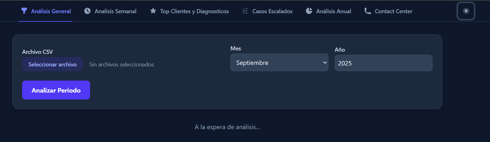

# 📊 Panel de Análisis de Datos "Bento Enterprise"

Este proyecto es una aplicación web interactiva y avanzada, construida con **Astro**, **React**, y **Tailwind CSS v4**, diseñada para realizar análisis complejos sobre datos de operaciones de Trouble Tickets (Soporte N1). 

La plataforma ha sido recientemente rediseñada siguiendo una arquitectura visual **"Bento Grid"**, priorizando la legibilidad gerencial, el alto contraste de datos y una experiencia de usuario (UX) sumamente pulida mediante componentes modernos y responsivos. Permite a los usuarios subir archivos CSV o TSV y obtener visualizaciones detalladas, métricas clave y rankings de rendimiento a través de múltiples paneles especializados.



---

## ✨ Características Principales

- **Arquitectura Visual "Bento Grid"**: Tarjetas asimétricas con bordes ultra sutiles que organizan la información de manera jerárquica y limpia.
- **Múltiples Paneles de Análisis**: Navegación por pestañas estilo "píldora" (Tabs) para acceder a módulos de análisis específicos.
- **Carga de Archivos Múltiples**: Soporte nativo para lectura de archivos (CSV para análisis de casos, TSV para métricas de contact center) directamente en el navegador de forma segura.
- **Visualización de Datos Avanzada**: Gráficos interactivos de Donut, Barras y Líneas de Área (con Chart.js) integrados a la paleta de colores semánticos de la aplicación.
- **Filtros Dinámicos e Interactivos**: 
  - Filtra datos por período (mes/año).
  - Selector de Agentes interactivo (Chips/Pills) para recálculo instantáneo de métricas.
  - Filtro desplegable por Segmento Comercial en los Rankings.
- **Modo Oscuro / Claro 🌙**: Soporte nativo y persistente. La paleta de colores (Índigo, Esmeralda, Ámbar, Azul Cielo) se adapta para garantizar contraste accesible en ambos modos.
- **Lógica de Dominio Aislada**: Cálculos complejos de SLAs, Tiempos de Resolución, ASA, ASQ y AHT completamente aislados en módulos de dominio tipados (TypeScript).

---

## 🛠️ Tecnologías Utilizadas

- **Framework Core**: [Astro 6](https://astro.build/) - Para el enrutamiento y rendimiento inicial.
- **Librería UI**: [React 18](https://react.dev/) - Para todo el motor interactivo y el estado de la aplicación.
- **Estilos CSS**: [Tailwind CSS v4](https://tailwindcss.com/) - Usando la nueva directiva `@theme` en CSS puro, sin archivos de configuración externos.
- **Componentes Base**: Inspirado en [Shadcn/UI](https://ui.shadcn.com/) y Radix UI primitives.
- **Parseo de Archivos**: [PapaParse](https://www.papaparse.com/) - Procesamiento ultrarrápido de CSV/TSV en el cliente.
- **Visualización**: [Chart.js](https://www.chartjs.org/) + `react-chartjs-2`.
- **Iconografía**: [Lucide React](https://lucide.dev/).

---

## 🚀 Cómo Empezar

Sigue estos pasos para levantar el proyecto en tu máquina local.

### Prerrequisitos

- Tener instalado [Node.js](https://nodejs.org/) (versión 18.0 o superior).
- Un editor de código como [Visual Studio Code](https://code.visualstudio.com/).

### Instalación

1.  **Clona el repositorio**:

    ```bash
    git clone [https://github.com/tu-usuario/tu-repositorio.git](https://github.com/tu-usuario/tu-repositorio.git)
    cd metricas-web
    ```

2.  **Instala las dependencias**:

    ```bash
    npm install
    ```

3.  **Inicia el servidor de desarrollo**:

    ```bash
    npm run dev
    ```

4.  **Abre tu navegador** y visita `http://localhost:4321` para ver la aplicación funcionando.

---

## 📁 Arquitectura del Proyecto

La aplicación sigue principios de **Clean Architecture** (Separación de Responsabilidades) adaptados para frontend:

- `src/layouts/`: Plantilla base de Astro (`Layout.astro`) que inyecta la tipografía Geist, el tema global y configura el canvas principal.
- `src/pages/`: Puntos de entrada de Astro. `index.astro` monta la SPA de React.
- `src/components/ui/`: Componentes genéricos y reutilizables de UI (Botones, Tablas, Acordeones, Selects).
- `src/components/specific/`: Vistas de negocio complejas (Dashboards). Aquí vive la UI de cada pestaña.
- `src/domain/`: Reglas de negocio puras (`caseAnalysis.ts`). Funciones sin estado ni dependencias visuales que transforman el CSV crudo en métricas utilizables.
- `src/application/hooks/`: Lógica de orquestación (`useCaseData.ts`). Conecta la UI con el dominio gestionando el estado (React Context/Hooks).
- `src/styles/`: Archivos base CSS. `theme.css` define las variables de color, y `global.css` integra Tailwind v4 y clases personalizadas (ej: `.bento-card`, scrollbars).

---

## 🔎 Módulos de Análisis (Vistas)

### 1. Resumen de Actividad (`GeneralAnalysisDashboard.tsx`)
El panel principal de métricas gerenciales.
- **Hero Metrics (3-Second Rule)**: Tarjetas superiores que muestran al instante Volumen Total, Casos Resueltos (%), Casos Pendientes y Origen Web.
- **Éxito SLA (Donut Chart)**: Gráfico central con el porcentaje exacto de resoluciones en menos de 24 horas.
- **Actividad Consolidada**: Tablas de alta legibilidad que cruzan el rendimiento por Modelo Comercial y por Agente individual.
- **Auditoría Individual**: Tarjetas detalladas para cada agente, mostrando su ratio de casos web vs propios y el desglose de "Razones de Cierre".

### 2. Auditoría Semanal (`WeeklyAnalysisView.tsx`)
Una vista jerárquica para entender qué pasó en los últimos 7 días.
- **Desglose de Reclamos**: Acordeones interactivos agrupados por "Razón". Al expandirlos, revelan las subrazones y los diagnósticos/soluciones aplicadas.
- **Casos Vinculados (Links HTML)**: Muestra un grid con todos los números de caso reales involucrados. Los números de caso mantienen los enlaces HTML del CSV original para acceso rápido al CRM.

### 3. Rankings de Operación (`TopStatsView.tsx`)
Identificación rápida de puntos críticos en el soporte.
- **Top 5 Diagnósticos Críticos**: Muestra los problemas más frecuentes mediante barras de progreso relativas y su solución habitual.
- **Top Clientes por Volumen**: Identifica qué clientes generan más carga operativa. Incluye un filtro interactivo por **Segmento Comercial** para aislar los datos.

### 4. Análisis de Escalamientos (`EscalationAnalysisView.tsx`)
Control de casos que requirieron derivación a segundo nivel.
- **KPI de Derivación**: Ratio total de escalamiento del volumen.
- **Registro de Casos Vinculados**: Una tabla limpia que expone el Caso Padre y el "Ticket Hijo" asociado (con link externo), indicando a qué bandeja fue derivado.

### 5. Evolución Histórica Anual (`YearlyAnalysisView.tsx`)
Vista macro del rendimiento a lo largo del año.
- **Gráfico de Área Suavizada**: Permite visualizar cómo los tiempos de resolución (SLA: <24hs, 24-48hs, etc.) evolucionan y se cruzan a través de los meses.
- **Tabla de Meses**: Desglose exacto tabular con "Pills" de colores para resaltar los cierres más veloces.

### 6. Análisis de Contact Center (`ContactCenterView.tsx`)
Módulo independiente para datos de telefonía y chat (TSV).
- Calcula automáticamente SLAs de atención, Tiempo Promedio de Espera (ASA), Tiempo Medio de Operación (AHT) y desglosa la atención por hora y agente.
